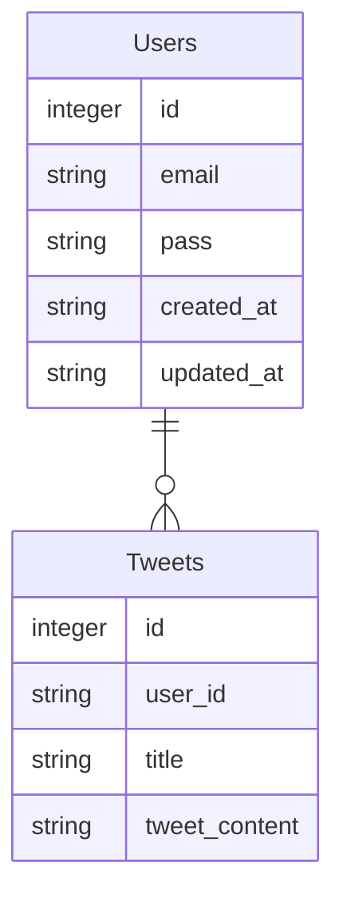

```mermaid
erDiagram

Users ||--o{ Tweets:""

Users {
  integer id
  string email
  string pass
  string created_at
  string updated_at
}

Tweets {
  integer id
  string user_id
  string title
  string tweet_content
}
```
