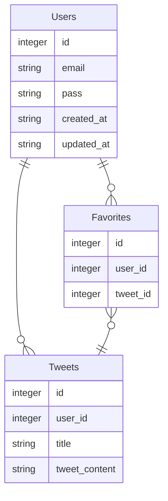

```markdown
# favoritesテーブルのレコードを考える
## 1つのツイートに複数のユーザーがいいねする時(tweet : user = 1 : 多)
id, user_id, tweet_id
1, 1, 1
2, 2, 1
3, 3, 1

## 一人のユーザーが複数のツイートにいいねする時のレコード(user : tweet = 1 : 多)
id, user_id, tweet_id
1, 1, 1
2, 1, 2
3, 1, 3
```
